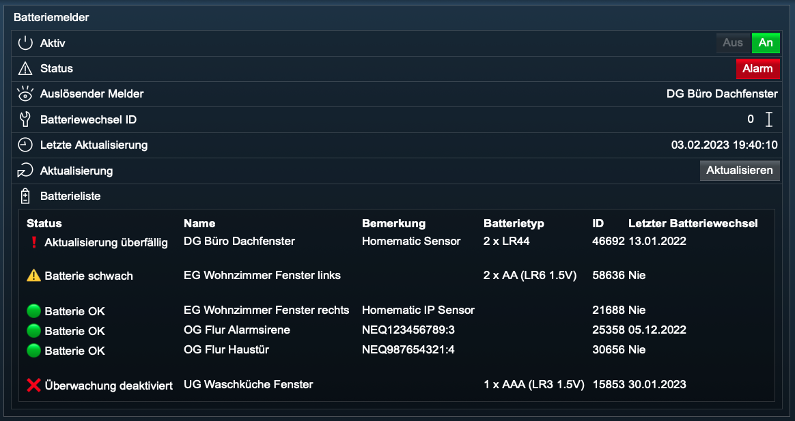

# Batteriemelder

Zur Verwendung dieses Moduls als Privatperson, Einrichter oder Integrator wenden Sie sich bitte zunächst an den Autor.

Für dieses Modul besteht kein Anspruch auf Fehlerfreiheit, Weiterentwicklung, sonstige Unterstützung oder Support.  
Bevor das Modul installiert wird, sollte unbedingt ein Backup von IP-Symcon durchgeführt werden.  
Der Entwickler haftet nicht für eventuell auftretende Datenverluste oder sonstige Schäden.  
Der Nutzer stimmt den o.a. Bedingungen, sowie den Lizenzbedingungen ausdrücklich zu.


### Inhaltsverzeichnis

1. [Modulbeschreibung](#1-modulbeschreibung)
2. [Voraussetzungen](#2-voraussetzungen)
3. [Schaubild](#3-schaubild)
4. [Auslöser](#4-auslöser)
5. [Benachrichtigungen](#5-benachrichtigungen)
6. [PHP-Befehlsreferenz](#6-php-befehlsreferenz)
   1. [Batteriestatus prüfen](#61-batteriestatus-prüfen)

### 1. Modulbeschreibung

Dieses Modul überwacht den Batteriestatus von Geräten in [IP-Symcon](https://www.symcon.de).

[]()

Aktiv:  
Es erfolgt immer eine überwachung der Melder.  
Ist der Schalter `Aktiv` in WebFront auf `Aus`, werden lediglich keine Benachrichtigungen versendet.  

Auslösender Melder:  
Gibt es mehrere kritische Melder, welche alphabetisch nach der Bezeichnung sortiert sind,  
so wird der Melder mit der höchsten Priorität angezeigt.

| Priorität | Status                      |
|-----------|-----------------------------|
| 1         | ⚠️ Batterie schwach         |
| 2         | 🟢 Batterie OK              |

Batteriewechsel ID:  
Wird ein Batteriewechsel ausgeführt und ist der Melder dann nicht mehr in einem kritischen Zustand,  
so wird der Melder aus der Tages- und der Wochenliste gelöscht.

Batterieliste:  
Die Überwachung der Melder und die Erstellung der Batterieliste wird immer durchgeführt.

### 2. Voraussetzungen

- IP-Symcon ab Version 6.1

### 3. Schaubild

```
                      +------------------------+
                      | Batteriemelder (Modul) |
                      |                        |
Auslöser------------->+ Status                 |
                      | Batterieliste          |
                      +------------------------+
```

### 4. Auslöser

Das Modul Batteriemelder reagiert auf verschiedene Auslöser.
Wird der Status eines Auslösers aktualisiert, so werden alle aktivierten Variablen überprüft.

### 5. Benachrichtigungen

##### 5.1 Sofortige Benachrichtigung

##### 5.1.1 Gerätestatus:

Ändert sich erstmalig der Gerätestatus von `OK` auf `Schwache Batterie`,  
so werden die sofortigen Benachrichtigungen für den Gerätestatus `Schwache Batterie` versendet.

Ändert sich Gerätestatus von `Schwache Batterie` wieder auf `OK`,  
so werden die sofortigen Benachrichtigungen für den Gerätestatus `OK` versendet.

Es werden Benachrichtigungen über die Änderung des jeweiligen Gerätestatus maximal ***einmal*** innerhalb des Zeitraums versendet.

#####  5.2 Tägliche Benachrichtigung

Eine Benachrichtigung über den Gerätestatus kann zu der festgelegten Zeit an den ausgewählten Tagen erfolgen.

#####  5.3 Wöchentliche Benachrichtigung

Eine Benachrichtigung über den Gerätestatus kann einmal wöchentlich zu der festgelegten Zeit erfolgen.

### 6. PHP-Befehlsreferenz

#### 6.1 Batteriestatus prüfen

```text
boolean BATM_CheckBatteries(integer INSTANCE_ID);
```

Der Befehl liefert als Rückgabewert **TRUE**, wenn alle Batterien `OK` sind, andernfalls **FALSE**.

| Parameter     | Wert  | Bezeichnung    |
|---------------|-------|----------------|
| `INSTANCE_ID` | 12345 | ID der Instanz |

**Beispiel**:
```php
$result = BATM_CheckBatteries(12345);  
echo $result;
```

---